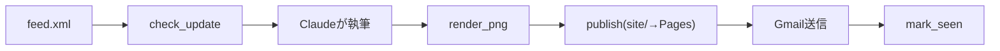
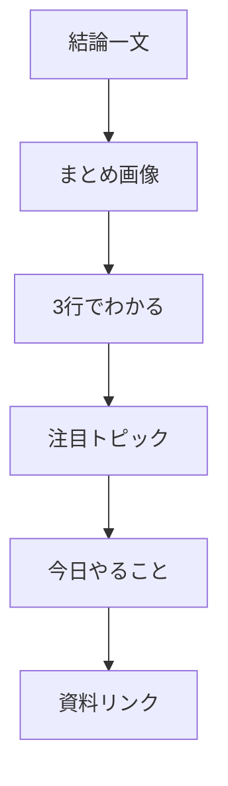
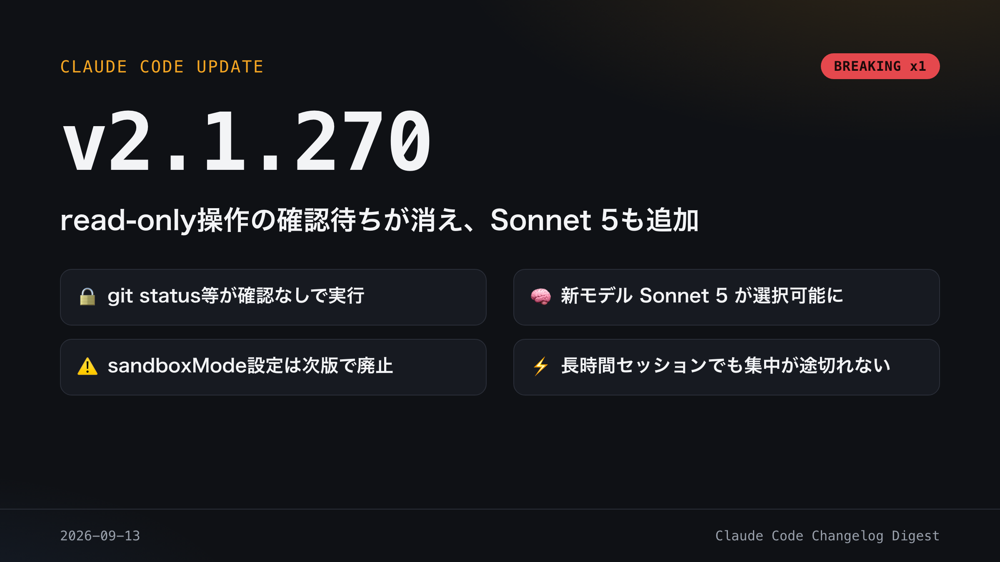
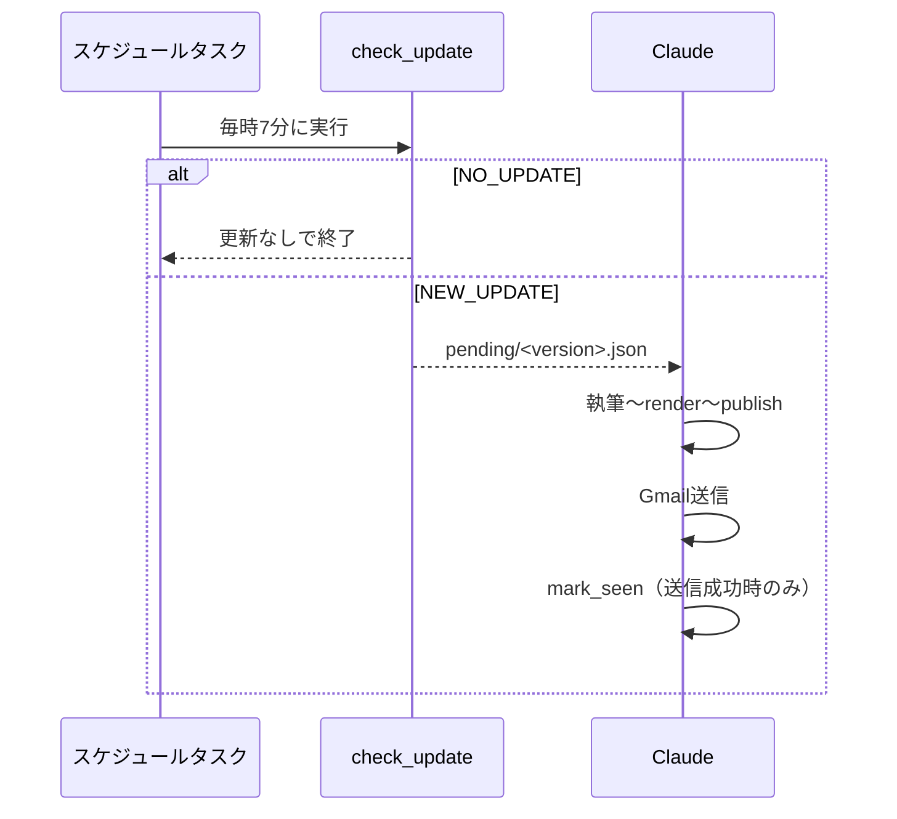
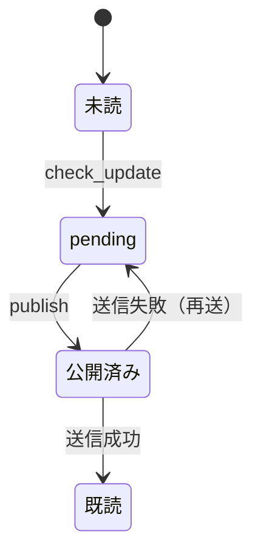

# cc-changelog-digest

Claude Code の CHANGELOG 更新を検知し、図付きメールで配信する。

## 1. 全体フロー



新着リリースを検知し、執筆・画像化・公開・送信・既読化までを自動で行う。

## 2. 届くもの



結論から入り、画像・要点・注目トピック・行動・詳細リンクの順で読める。

サンプル画像（架空データ、実際のリリース内容ではありません）:



## 3. 動作の仕組み



更新が無ければ何もせず終わる。あるときだけ執筆から送信まで一気通貫で進む。

## 4. 状態管理



送信に失敗した版は既読化されず、次回また自動で再送が試みられる。

## 5. ディレクトリ構成

```
scripts/
  check_update.py   feed.xmlを取得し新着バージョンを検知、state/pending/<ver>.jsonを書く
  classify.py       キーワード辞書によるプレ分類（breaking/major/model/added/changed/removed/fixed/other）
  render_png.py     out/<ver>/card.html・report.htmlをplaywrightでPNG化
  publish.py        out/<ver>をsite/<ver>にコピーし、index.html更新、git commit & push
  mark_seen.py      state/last_seen.jsonに既読バージョンを追記、pending JSONを削除
  session_link.py   実行中セッションIDの推定（best-effort）
templates/          report.html/card.html/email.htmlなどのテンプレと執筆規約
state/
  last_seen.json    既読バージョン一覧と最終チェック時刻
  pending/          未処理の新着バージョンJSON（.gitignore対象）
out/                生成物（report.html, card.html, *.png, summary.md）バージョンごと
site/               GitHub Pages公開先（index.html + <ver>/）
tests/              unittest一式、フィクスチャはtests/fixtures/
docs/               詳細ドキュメント（setup/operations/scripts/writing-guide/design-decisions）
```

## 6. はじめ方

1. `pip install -r requirements.txt` で依存関係を入れる。
2. Claude デスクトップで Gmail 連携とスケジュールタスクを設定する。
3. `python3 scripts/check_update.py` で動作確認する。

詳細手順は [docs/setup.md](docs/setup.md) を参照。

## 7. 詳細ドキュメント

- [docs/setup.md](docs/setup.md) — セットアップ・Pages設定・スケジュールタスク登録
- [docs/operations.md](docs/operations.md) — 日々の運用・手動実行・失敗時の挙動
- [docs/scripts.md](docs/scripts.md) — 各スクリプトの引数・出力・終了コード
- [docs/writing-guide.md](docs/writing-guide.md) — 執筆の考え方の概要
- [docs/design-decisions.md](docs/design-decisions.md) — 設計判断とその理由

テストの実行:

```bash
python3 -m unittest discover -s tests
```
